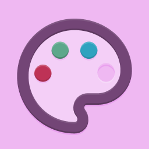

<div align="center">



# Loose RGB

**Normalizes RGB color data types to a certain format**

[](https://www.npmjs.com/package/loose-rgb)
[](https://github.com/evelynhathaway/loose-rgb/actions)
[](https://bundlephobia.com/result?p=loose-rgb)
[](/LICENSE)

</div>

## Description

Working with different color libraries gets cumbersome when they use different RGB value formats. Now you can [`normalize`](#normalize) the outputs and [`convert`](#convert) your inputs.

## Features

- Normalize any RGB format to `{r, g, b, [a]}`
- Convert `{r, g, b, [a]}` to any RGB format
- RGBA support
- Hex support

## Installation

```bash
npm install loose-rgb
```

## Usage

```js
import looseRGB from "loose-rgb";

// Convert any type to `{r, g, b, [a]}`
looseRGB.normalize({red: 1, green: 2, blue: 3}) // ? {r: 1, g: 2, b: 3}
looseRGB.normalize("FFBB00AA") // ? {r: 255, g: 187, b: 0, a: 0.66796875}

// Convert `{r, g, b, [a]}` to any type
looseRGB.convert.toCSSValue({r: 255, g: 187, b: 0, a: 0.66796875}) // ? rgba(255, 187, 0, 0.66796875)
looseRGB.convert.toUpperKeys({r: 1, g: 2, b: 3}) // ? {R: 1, G: 2, B: 3}

// Composing the above methods
import {convert, normalize} from "loose-rgb";

const anyToHex = (rgba) => convert.toHex(normalize(rgba));
anyToHex([1, 2, 3, 0.4]) // ? #01020366
```

### Normalize

`looseRGB.normalize(color: RGBUnkown)`

Input any color value as `color` (see [`convert`](#convert)).

### Convert

`looseRGB.convert[to{ColorType}](color: RGBLowerKeys)`

Input an `{r, g, b, [a]}` color to get a reformatted value. See [supported formats](#supported-formats) for methods.

#### Supported Formats

- **`.toLowerKeys()`**
	- `{r: 1, g: 2, b: 3}`
	- `{r: 1, g: 2, b: 3, a: 0.4}`
- **`.toUpperKeys()`**
	- `{R: 1, G: 2, B: 3}`
	- `{R: 1, G: 2, B: 3, A: 0.4}`
- **`.toFullKeys()`**
	- `{red: 1, green: 2, blue: 3}`
	- `{red: 1, green: 2, blue: 3, alpha: 0.4}`
- **`.toArray()`**
	- `[1, 2, 3]`
	- `[1, 2, 3, 0.4]`
- **`.toCSSValue()` —** Supports with and without spacing between commas, leading zero on decimal
	- `"rgb(0, 213, 34)"`
	- `"rgba(0, 213, 34,.12)"`
- **`.toHex()` —** Supports with and without pound, case insensitive, with shorthand
	- `"#fff"`
	- `"#000000"`
	- `"#FFBB00AA"`
	- `"123"`
	- `"FFFF"`

## License

Copyright Evelyn Hathaway, [MIT License](/LICENSE)
